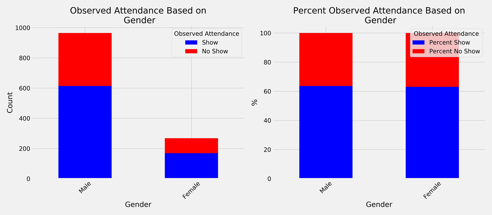

# Predicting Interview Attendance

*by Jacob and Marc*

## Table of Contents
- [Introduction](#introduction)
  - [Background](#background)
  - [Case Study Goal](#case-study-goal)
  - [Minimum Viable Product](#minimum-viable-product)
  - [Datasets](#datasets)
- [Cross-validation](#cross-validation)
  - [Train-Test Split](#train-test-split)
- [Exploratory Data Analysis](#exploratory-data-analysis)
  - [Feature Categories](#feature-categories)
- [Learning Models](#learning-models)
  - [Random Forests](#random-forests)
    -[Training](#training)
    -[Results](#results)
- [Citation](#citation)

## **Introduction**

### **Background**
A recruitment industry in India is interested in predicting whether candidates will show up to an interview for various clients. Naive Bayes has already been attempted, and has shown decent results. We would like to know if we can better predict using other algorithms, feature engineer new variables, or modify the present set of variables to yield better results.

Data sourced from Kaggle  (https://www.kaggle.com/vishnusraghavan/the-interview-attendance-problem)

### **Case Study Goal**

In this case study we will use non-parametric supervised learning models to create a predictive machine learning model. It may be interesting to compare non-parametric to parametric (linear/logistic regression) results.

### **Datasets**  
Since we are interested in predicting interview attendance we needed to use all information available to create a model capable of best predicting the outcome of whether or not a candidate will show up to the interview.

- Date of Interview: Split Into Year, Day of week, and Month to investigate trends
- Client Name: Company hosting interview
- Industry: Type of industry of Client/Company
- Location: Location of candidate
- Position to be closed: Type of position (Niche refers to rare skill sets, routine refers to common skill sets) 
- Nature of Skillset: Client skills
- Interview Type: 3 Types: Walkin drives (unscheduled), Scheduled, Scheduled walkin
- Name: Identical to index, number of candidate used to conceal identity
- Gender
- Candidate Current Location: Redundant with Location
- Candidate Native location
- Marital Status
- Interview Venue	

Factors of Interview Scheduling - These questions were asked and the candidates response is recorded:
 - Have you obtained the necessary permission to start at the required time?
 - Hope there will be no unscheduled meetings	Can I Call you three hours before the interview and follow up on your attendance for the interview?
 - 	Can I have an alternative number/ desk number?
 - 	Have you taken a printout of your updated resume? 
 -  Have you read the JD?
 -  Are you clear with the venue details and the landmark?	
 -  Has the call letter been shared?

Test/Target Variables:
 -  Expected Attendance (Based on current prediction metrics)	
 -  Observed Attendance: Target variable, whether or not candidate attended interview

## **Exploratory Data Analysis**

Yes or No questions were converted to boolean. Unknown entries were assumed to be no.

Factors that had more than two, but fewer than 10 possible answers were one hot encoded.

After some ...
 

  

 
### **Feature Categories**

#### **First Selection** 

Our first approach, we chose to keep all ten features:

    Take Resume, Obtain Permission, No unschedules meetings, Locations match, confirmed location, alternative phone number, three hour call, call letter, gender, married

As we will discuss soon, using all the features provided marginally better results than when we reduced the feature count.

Our second approach limited the useful metrics to the following three:

    Location match, 3hr Call, Alternative phone

In the following plots, the left side represents the total counts while the right scales the counts to the top of the plot allowing us to see differences in ratio.

  

  

  

The most useless features were Marrital status and was Male vs Female where little to no predictive value was obtained.
 

  
  

Notice how for marital status on the left plot, there are more non-married interviewing but when we scale the plot there is almost no difference between marrital status.

## **Cross-validation**

### **Train-Test Split**

The data was split using a conventional 80/20 split where the training data consisted of 80% of the full dataset while we held out 20% of the data to test our final model on.

  

## **Learning Models**

### **Logistic Regression** ##

Our first attempt was to try to fit the data using logistic regression, since our target variable is binary (Attended or did not attend)

### **Random Forests**

We thought it would be a good approach to try a random forest because random forests work well with large datasets with many features and are unlikely to overfit the data.

### **Multilayer Perceptron**

#### **Training**
Our first approach 

  

#### **Results**

When we tested on unseen data, our results were: prediction accuracy was...

## **Citation**
This case study is based on [The Interview Attendance Problem](https://www.kaggle.com/vishnusraghavan/the-interview-attendance-problem).  

  

Near the end of the day you'll be asked to present capstone results from your project README.    
Please present:  
* Your problem statement  
* A description of your data  
* EDA and feature engineering  
* Your modeling approach  
* How you decided on your final model  
* Model results on unseen data  
* Relevance to the real world  
* Areas for future work  

Notes: 
Be wary of data leakage - unwittingly providing more information about your target in your 
dataset than would be available at the time of prediction.  Read more [here.](https://www.kaggle.com/dansbecker/data-leakage)

To determine real-world relevance, you usually need to bring in your out-of-model knowledge to 
quantify the cost-benefit of performance metrics.  Recall your profit-curve assignment!

