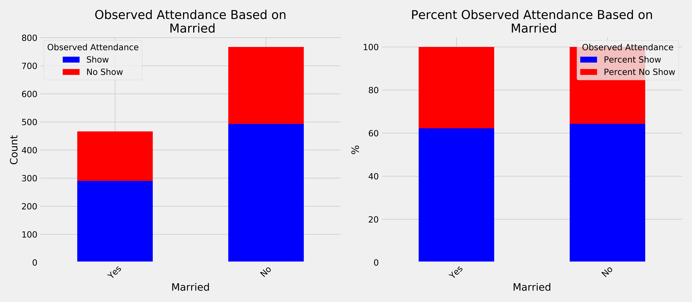
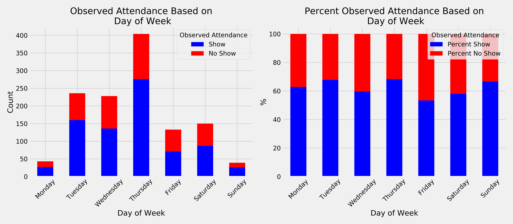
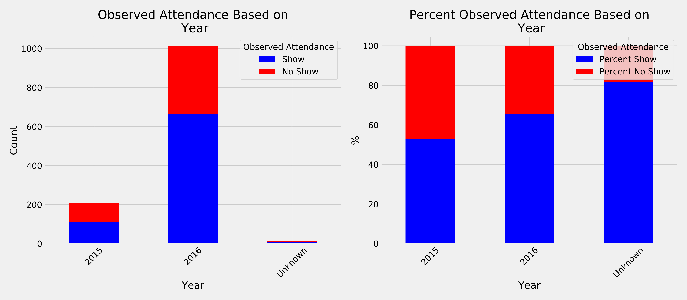

  

# Predicting Interview Attendance

*by Jacob and Marc*

## Table of Contents
- [Introduction](#introduction)
  - [Background](#background)
  - [Case Study Goal](#case-study-goal)
  - [Datasets](#datasets)
- [Exploratory Data Analysis](#exploratory-data-analysis)
  - [Binary Features](#binary-features)
  - [Time-based Features](#Time-based-Features)
- [Cross-validation](#cross-validation)
  - [Train-Test Split](#train-test-split)
- [Learning Models](#learning-models)
  - [Logistic Regression](#logistic-regression)
  - [Random Forests](#random-forests)
  - [Multi-Layer Perceptron](#multi-layer-perceptron-(MLP))
  - [Results](#results)
- [Relevance to the Real World](#Relevance-to-the-Real-World)
- [Conclusion](#conclusion)
- [Future Steps for Improvement](#Future-Steps-for-Improvement)
- [Citation](#citation)

## **Introduction**

### **Background**
A recruitment industry in India is interested in predicting whether candidates will show up to an interview for various clients. Naive Bayes has already been attempted, and has shown decent results. We would like to know if we can better predict using other algorithms, feature engineer new variables, or modify the present set of variables to yield better results.

Data has been sourced from Kaggle.

### **Project Goal**

In this project we will use non-parametric supervised learning models to create a predictive machine learning model. It may be interesting to compare non-parametric to parametric (linear/logistic regression) results.

We will be comparing our results with the results of the authors of the dataset.

### **Datasets**  
Since we are interested in predicting interview attendance we needed to use all information available to create a model capable of best predicting the outcome of whether or not a candidate will show up to the interview.

- Date of Interview: Split Into Year, Day of week, and Month to investigate trends
- Client Name: Company hosting interview
- Industry: Type of industry of Client/Company
- Location: Location of candidate
- Position to be closed: Type of position (Niche refers to rare skill sets, routine refers to common skill sets) 
- Nature of Skillset: Client skills
- Interview Type: 3 Types: Walkin drives (unscheduled), Scheduled, Scheduled walkin
- Name: Identical to index, number of candidate used to conceal identity
- Gender
- Candidate Current Location: Redundant with Location
- Candidate Native location
- Marital Status
- Interview Venue	

Factors of Interview Scheduling - These questions were asked and the candidates response is recorded:
 - Have you obtained the necessary permission to start at the required time?: Abbreviated to "Permissions"
 - Hope there will be no unscheduled meetings	Can I Call you three hours before the interview and follow up on your attendance for the interview? : Renamed as "No Unscheduled Meetings"
 - 	Can I have an alternative number/ desk number?: Renamed "Alternate Phone Number"
 - 	Have you taken a printout of your updated resume? Have you read the JD?: Renamed "Took Resume and Read JD"
 -  Are you clear with the venue details and the landmark?: Renamed "Confirmed Location"
 -  Has the call letter been shared?: Renamed "Call Letter"

Test/Target Variables:
 -  Expected Attendance (Based on current prediction metrics)	
 -  Observed Attendance: Target variable, whether or not candidate attended interview

We created a new feature "Local Candidate" which is a boolean feature of whether or not the candidate location is the same as the job location.

## **Exploratory Data Analysis**

Yes or No questions were converted to boolean. Unknown entries were assumed to be no.

Factors that had more than two, but only a few possibilities were one hot encoded.

This leaves three features that were too large to one hot encode or had too many unique answers with very few responses:

    Candidate native location, company, skillset

### **Binary Features**
Our first approach, we chose to keep all ten features:

    Take Resume, Obtain Permission, No unschedules meetings, 
    Locations match, confirmed location, alternative phone number, 
    three hour call, call letter, gender, married

As we will discuss soon, using all the features provided marginally better results than when we reduced the feature count.

Our second approach limited the useful metrics to the following three:

    Location match, 3hr Call, Alternative phone

In the following plots, the left side represents the total counts while the right scales the counts to the top of the plot allowing us to see differences in ratio.

  

  

  

The most useless features were Marital status and Male vs Female where little to no predictive value was obtained.

  

  

Notice how for marital status on the left plot, there are more non-married interviewing but when we scale the plot there is almost no difference between marrital status. Although significantly more men interviewed, the likelihood of each gender showing up to the interview was nearly identical. Gender shows a similar situation where men represent a higher interview *count* but a nearly identical interview *rate*.

### **Time-based Features**

We wanted to analyze how interview dates affected attendance rates. To do this we needed to disect the date column into a more workable form. 

We used a python package called datetime which allowed us to analyze the interview attendance rates on a daily, weekly, and monthly basis. We also installed the dateparser library which contained the parse function, which was able to take nearly all formats of the dates entered in the raw data and convert them into a usable datetime object. Only a few values had to manually corrected.

We split the date columns into 4 different columns: Year, Month, Day, and Day of Week. We thought that there would be certain days of the week that would produce significantly more or less attendance rates (especially Monday/Friday). 

  

As you can see above, there is little to no correlation between day of the week and attendance rates. Despite this there is a significantly higher number of interviews (both attended and unattended) on Fridays.

Next we wanted to look at the relationship between day of the month and attendance rates. We suspected that there might be an increase in interview counts towards the end of the month (as a result of bills).

  

Notice above how the attendance for days of the month seem to not follow any noticable trends. This, again, pushed us to not include this feature in our machine learning model.

We continued the date-time analysis with a study on how attendance rates change in relation to the months of the year. We conducted some research into Indian holidays but when comparing with the plot we did not see much alignment.

  

Again, notice how in the above plot there is little if any correlation between attendance rates and months of the year.

We next wanted to look at how observed attendance changes on a yearly basis

  

Previous analysis of days and months could be skewed by what we observe in the above plot. Since the interview data starts partially through 2015, certain months will be have data from both years while other months may only consist of data from a single year. This shows the importance of the "Percent Observed Attendance" which ignores overall counts and scales appropriately.

## **Cross-validation**

### **Train-Test Split**

The data was split using a conventional 80/20 split where the training data consisted of 80% of the full dataset while we held out 20% of the data to test our final model on.

## **Learning Models**

### **Logistic Regression**

Our first attempt was to try to fit the data using logistic regression, since our target variable is binary (Attended or did not attend). After training we found a test accuracy of 70%, which was very close, but not greater than the author's value of 70.8%. Precision score was 71.6%, and recall score was 84.6%.

### **Random Forests**

We thought it would be a good approach to try a random forest because random forests work well with large datasets with many features and are unlikely to overfit the data.

For simplicity, we only included the binary numeric features into account for the model: Gender, Permissions, No Unscheduled Meetings, 3 Hour Confirmation Call, Alernate Phone Number, Took Resume and Read JD, Confirmed Location, Call Letter Shared, Marital Status, and Local Candidate.

When we created and tested our random forest model on a holdout dataset, our accuracy score was 71.5%, precision of 72%, and a recall of 86.7%.

This may be improved by one hot encoding the columns that were dropped, but this would come at the cost of computational expense. This could be reconsidered later for future improvement.

We wanted to look at and compare the feature importance of the random forest with our earlier EDA.

  

We found that the most important feature for the random forest model was whether or not the candidate had permission to start at the scheduled time. This aligned with our previous finding but the second and third most important features did not (namely "Call letter Shared" and "Took Resume").

### **Multi-Layer Perceptron (MLP)**

For our Multi-layer perceptron, we started by building the simplest model consisting of ten binary input nodes, one hidden layer, and a single output node for predicted attendance. Below is an illustration that shows the simple model architecture (with only four inputs instead of ten).

  

After training, we found this simple model to perform nearly as well as the random forest.

We began adding complexity to our mlp model by changing the number of hidden layers and other hyper parameters with diminshing returns. The increase in computational time was not justified by the minimal increase training accuracy that we were observing.

If we were deploying this mlp model we would compromise heavily towards simplicity and reducing computational expense at a cost of slightly lower accuracies.

## **Results**

Our best performing model was a random forest with an overall accuracy of 71%.

When we tested our MLP model on unseen data, our prediction accuracy was 70.6% with all 10 features not including date/time and 67.2% with only one feature (3 Hour Call). While there is only a small decrease in performance with limiting the model to a single feature, if computational expense was of concern we could prioritize the limiting of feature count.

When compared to the Kaggle-dataset authors' naive bayes results, we did slightly better. They created a model with an overall accuracy of 70.8% while ours was 71.5%. 

## **Relevance to the Real World**

To improve job candidate interview attendance, we based our recommendations on the feature importances of the model. Since Permissions are the most important feature, we should require recruiters to confirm with the candidates that they have the required permissions to attend the interview at the scheduled time. We should also requiring the recruiter to share a call letter with the candidate. Finally, confirming that the candidate takes their resume and reads the job description should also improve interview attendance rates.

## **Conclusion**

While our model this is not an overwhelming triumph, we proved that we can make a comprable models to the authors while using different machine learning tools. With further cleaning of the data, we can possibly improve our models even further.

## **Future Ideas for Improvement**
- Give Unknown/NA entries in data a specific category and then one hot encode them instead of lumping them with either yes or no and using them as binary values
- For random forest model and regression models, one hot encode the more complicated features and see if the trade off in computational expense is worth the potential increase in accuracy
- Pull partial dependence plots based on feature importances to confirm directions of recommendation
- Try more classification models
- Use Natural language processing on the skillset column and clean it up to assess possible correlation

## **Citation**

This case study is based on [The Interview Attendance Problem](https://www.kaggle.com/vishnusraghavan/the-interview-attendance-problem).

[MLP Image](https://texample.net/media/tikz/examples/PNG/neural-network.png)

[Header Image](https://resources.workable.com/closing-interview-questions)